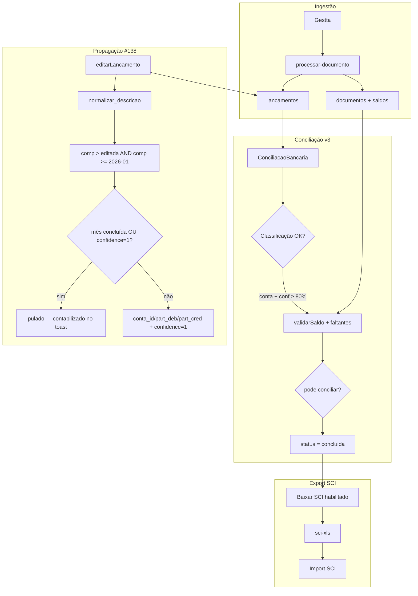

# Conciliação v3 — Especificação

> **Fonte oficial:** transcrição *Follow UP | Fase 1 | LCR* (Bruno, Cleyton, João · LCR — Mariana · IAP)
>
> **Status:** aprovado para implementação · **Repo:** lcr-flow (LCR-front) · **Epic:** [#129](https://github.com/mmarques30/lcr-flow/issues/129)

---

## Decisões de produto (fechadas)

| Tema | Decisão | Transcrição (ref.) |
|------|---------|-------------------|
| Tolerância de saldo | **± R$ 0,01** (centavos) | Cleiton ~10:15 — equação matemática |
| Conciliação bancária | **Saldo inicial + movimentações ≈ saldo final**; não par D/C por linha | ~05:23–08:21 (ex. CDB +13k) |
| Travas para Conciliar | (1) **Cobertura** extrato→lançamentos (2) **Classificação** atribuída (3) **Saldo** coerente | Cleiton ~12:19–14:22 |
| Classificação temporária | Permitida (“aguardando cliente”) — **não trava** import | ~13:16–14:22 |
| Transação faltante | **Ambos:** extrato sem classificação **e** `fonte_extrato` sem linha CSV | ~12:19 |
| Sem documento suporte | Visibilidade/enriquecimento — **não trava** conciliação | ~15:21–17:31 |
| Conciliar → SCI | Desbloqueia **Baixar SCI** (botão ainda não implementado) | ~01:07:37 |
| Contas na planilha | **Código reduzido** (`plano_de_contas_lcr` col A) — **não** apelido legado (col E) | ~28:00–36:08 |
| Histórico na planilha | **Código** (`historicos_sci_lcr.codigo`, col A da planilha oficial) — col **Apelido desconsiderada** | ~00:56:07 |
| `pula_complemento` | Respeitar flag na export (complemento vazio quando Sim) | ~00:54:33 |
| Contas T / C | Só **analítica** aceita lançamento (ex. T 29 → analítica 20) | ~33:23–37:13 |
| Contrapartida banco | D/C deve trazer conta analítica **e** banco (ex. 148 ↔ 657 Itaú) | ~42:38–44:13 |
| Banco múltiplas CC | Padrão = **conta nº 1**; personalização por cliente = fase futura | ~46:52–48:44 |
| Propagação | Por **`normalizarDescricao()`**; competências **> editada** e **≥ 2026-01**; inclui meses **já processados**, exceto **concluídos** (não reabre) e lançamentos já **confirmados por humano** (`confidence = 1`) | ~01:03:30–01:07:37 |
| Não alterar | Competências **2025** | ~01:04:35 |
| Extrato fora da competência | Ignorar “próximos lançamentos” / dia 1 do mês seguinte | João/Cleiton ~01:21:40 |

---

## Conceito de conciliação (alinhamento cliente)

> *“Cada linha é um valor individual — não precisa linha seguinte com natureza inversa.”* — Cleiton ~08:21

**Não é:** buscar par débito/crédito linha a linha entre razão e extrato.

**É:**

1. Validar **saldo final** considerando **saldo anterior + movimentações do período**.
2. Garantir que **todas as transações do extrato** estão listadas/classificadas para import SCI.
3. Garantir **classificação** (conta/histórico) — inclusive temporária quando depende do cliente.

O painel “Na razão sem par / No extrato sem par” **deixa de fazer sentido** como gate (~16:19).

---

## Arquitetura alvo



---

## Regras de negócio

### Validação de saldo

```
delta = saldo_final - (saldo_inicial + movimentacao_liquida)
|delta| <= 0.01  →  saldo_confere = true
```

### Três travas (Cleiton)

| # | Trava | Bloqueia Conciliar? |
|---|-------|---------------------|
| 1 | Toda transação do extrato → lançamento na competência | **Sim** (faltante) |
| 2 | Toda transação **categorizada** (conta; conf ≥ 80% ou classificação temporária explícita) | **Sim** (revisão) |
| 3 | Saldo final **coerente** com import | **Sim** (delta) |
| — | Sem documento suporte / docs órfãos | **Não** |
| — | Par D/C linha a linha | **Removido** |

### Transações faltantes

| Tipo | Definição |
|------|-----------|
| **Extrato sem classificação** | Linha CSV sem lançamento match (valor centavos + data ±3d) **com conta** |
| **Classificado sem extrato** | `fonte_extrato = true` sem linha CSV correspondente |

NFs/recibos (`fonte_extrato = false`) **não** entram em “sem extrato”.

Ambas as travas exigem **mesmo sinal** além de mesmo valor em módulo — um
débito e um crédito de mesmo valor absoluto (ex.: PIX enviado e PIX recebido
no mesmo dia) não casam entre si (*fix sinal cruzado*, code review 20/07).

### Sinal débito/crédito (fix 21/07 — code review)

O sinal de cada lançamento vinha **100% da interpretação da IA**
(`s.tipo_movimento` em `processar-documento`), sem nenhum cruzamento
determinístico com o CSV bruto do próprio extrato. Correção em duas camadas:

1. **Override na ingestão** (`processar-documento/parse-csv-sinal.ts`) — ao
   processar um extrato com arquivo original **já textual** (CSV/TXT, não
   PDF/imagem), reparseia o CSV bruto por linha e marca `sinalExplicito=true`
   quando a estrutura do próprio arquivo já deixa o sinal inequívoco: coluna
   `tipo`/`débito`/`crédito` dedicada, colunas débito/crédito separadas, ou
   valor já assinado no texto (`-100,00` ou `(100,00)`). Quando há
   **exatamente 1** linha do CSV com a mesma data + valor e sinal explícito,
   esse sinal **sobrescreve** o palpite da IA antes do insert em `lancamentos`.
   Ambíguo (0 ou 2+ candidatos, ou CSV sem estrutura inequívoca) → mantém a
   decisão da IA (comportamento anterior).
2. **Alerta não-bloqueante** (`conciliar/saldo.ts` → `detectarFaltantes` →
   `divergencias_sinal`) — cobre o que a camada 1 não resolve (extrato
   enviado como PDF/imagem, ou CSV sem estrutura explícita): cruza as
   "sobras" das duas travas de faltantes buscando pares com mesma data
   (±3 dias) e mesmo valor absoluto, porém sinal oposto. Não altera
   `faltantes_count` nem bloqueia nada — só aparece como banner informativo
   na tela de Conciliação (revisão manual, se fizer sentido).

Por que não um cross-check 100% determinístico de ponta a ponta: os CSVs que
os clientes sobem são heterogêneos (por isso a IA é usada pra interpretá-los);
um parser determinístico só é confiável quando o próprio arquivo já é
estruturalmente inequívoco. Fora isso, a decisão continua sendo da IA.

### Export SCI

> **Correção (transcrição ~00:56:07):** coluna HISTÓRICO usa **código** (`historicos_sci_lcr.codigo`). A coluna *Apelido* da planilha de históricos e `historicos_contabeis.sci_apelido` **não entram** no export — eram legado do sistema anterior (como col E do PDC para contas).

| Coluna | Fonte | Não usar |
|--------|-------|----------|
| DÉBITO / CRÉDITO (analítica) | `plano_de_contas_lcr.apelido` (= código reduzido, col A PDC) | `plano_contas.sci_apelido` (col E legado) |
| DÉBITO / CRÉDITO (banco) | Código reduzido da CC **nº 1** | — |
| HISTÓRICO | `historicos_sci_lcr.codigo` (col A históricos) | col Apelido / `sci_apelido` |
| COMPLEMENTO | Vazio se `pula_complemento = true`; senão descrição (≤80 chars) | — |

**Contas T/C:** resolver para filha analítica antes de exportar.

**Gate:** `Baixar SCI` disabled se `conciliacoes.status !== 'concluida'`.

### Propagação (#138)

Ao salvar edição de conta e/ou participante (`editarLancamento`), a correção se
propaga automaticamente para lançamentos com a mesma descrição em competências
futuras **já processadas** — não só em documentos novos:

- Chave: `normalizar_descricao(descricao)` (função SQL, espelha `normalizarDescricao()` do TS) + `empresa_id`
- Escopo: `competencia > :editada` **AND** `competencia >= '2026-01'`
- Inclui competências **já processadas** no banco (analogia "agenda recorrente" ~01:09:44)
- **Regra final (decidida com o cliente, fechando o gap da reunião):**
  - **Bloqueia meses já `concluida`** — não altera nem reabre, evita dessincronia
    silenciosa com o que já foi exportado pro SCI. Reabertura automática fica
    para o [#143](https://github.com/mmarques30/lcr-flow/issues/143) (futuro).
  - **Pula lançamentos já confirmados manualmente por humano** em meses futuros
    — só propaga onde a IA ainda decide sozinha. *(Fix 20/07: `confidence = 1`
    por si só não é prova de confirmação humana — a própria propagação marca
    `confidence = 1` nos lançamentos que ela atualiza. Sem checar também
    `part_aprendido`, uma 2ª edição na origem parava de propagar pros meses já
    tocados pela 1ª propagação. Guard corrigido para
    `confidence = 1 AND part_aprendido = true`.)*
  - Campos propagados: `conta_id`, `part_deb`/`part_cred` (coalesce — só
    sobrescreve se a origem tiver valor); resultado marca `confidence = 1` e
    `part_aprendido = true` nos lançamentos atualizados.
- RPC: `propagar_lancamento_por_descricao(p_lancamento_id uuid)` (`SECURITY DEFINER`),
  chamada best-effort a partir de `editarLancamento` — nunca derruba a edição
  original em caso de falha.
  - Retorno: `{ atualizados, pulados_concluida, pulados_confirmados }`
  - UI mostra toast com os três números (atualizado com sucesso / pulado por
    mês concluído / pulado por confirmação humana)
- Auditoria: o `UPDATE` da RPC dispara `trg_audit_lancamentos` normalmente —
  toda propagação já fica registrada em `audit_log` sem trabalho extra.
- Fora de escopo (adiado): propagar histórico contábil (`hist_sci_codigo`) —
  depende do [#140](https://github.com/mmarques30/lcr-flow/issues/140) (editar
  histórico na UI, ainda sem campo em `editarLancamento`).

### Edição na UI

- **Conta contábil** — já existe
- **Histórico** — combobox código + descrição (~00:51:58) → [#140](https://github.com/mmarques30/lcr-flow/issues/140)

---

## Backlog (transcrição — fase 2+)

| Item | Notas |
|------|-------|
| Coluna extra “Histórico bancário” na planilha | Cleiton sugeriu; Mariana: aprendizado de complemento já cobre → **opcional** |
| Export SCI **multi-mês** (jan–jun consolidado) | ~01:12:18 — possível, exige mudança de modelo |
| Flag docs a solicitar + e-mail Gestta | ~00:19:25 — não pedir NF da própria LCR |
| Personalização banco CC por cliente | ~00:48:44 — após fase 1 estável |
| Contas **“C” (consolidadas)** sem filhas no Plano de Contas atual | João ~00:37:13–00:39:53 — Mariana pediu ao Cleyton/João reenvio do Plano de Contas “aberto” com as contas-filha. **Depende de arquivo novo do cliente**, não é tarefa de código |

---

## Roadmap e issues

### Fase 1 — MVP (ordem de implementação)

| Ordem | Issue | Tarefa |
|-------|-------|--------|
| 1 | [#130](https://github.com/mmarques30/lcr-flow/issues/130) | Motor saldo + faltantes (EF `conciliar`) |
| 2 | [#139](https://github.com/mmarques30/lcr-flow/issues/139) | Filtrar extrato por competência (próximos lançamentos) |
| 3 | [#134](https://github.com/mmarques30/lcr-flow/issues/134) | SCI: código reduzido + histórico código + pula_complemento |
| 4 | [#131](https://github.com/mmarques30/lcr-flow/issues/131) | UI saldo/delta/faltantes |
| 5 | [#132](https://github.com/mmarques30/lcr-flow/issues/132) | Remover pareamento D/C |
| 6 | [#133](https://github.com/mmarques30/lcr-flow/issues/133) | Travas revisão + saldo + faltantes |
| 7 | [#135](https://github.com/mmarques30/lcr-flow/issues/135) | Gate Baixar SCI |
| 8 | [#136](https://github.com/mmarques30/lcr-flow/issues/136) | Contas T/C → analítica |

### Fase 2

| Issue | Tarefa | Status |
|-------|--------|--------|
| [#138](https://github.com/mmarques30/lcr-flow/issues/138) | RPC propagação cross-competência | ✅ Implementado e mesclado (PR #146) — ver seção "Propagação (#138)" acima |
| [#140](https://github.com/mmarques30/lcr-flow/issues/140) | Editar histórico na conciliação | ✅ Implementado e mesclado (PR #148) |
| [#137](https://github.com/mmarques30/lcr-flow/issues/137) | Log inatividade + eventos | ✅ Implementado — ver seção "Observabilidade (#137)" abaixo |
| — | Code review 20–21/07: guard propagação, paginação (>1000/5000 linhas), sinal cruzado, sinal débito/crédito, testes automatizados | ✅ Aplicado — ver seções "Sinal débito/crédito" acima e "Testes automatizados" abaixo |

### Tier 2/3 (standby — depende de feedback do cliente)

| Item | Descrição | Status |
|------|-----------|--------|
| Resolução dinâmica de banco (CC nº 1) | Trocar dicionário `BANCO_PARA_CODIGO` (16 bancos hardcoded) por resolução contra `plano_de_contas_lcr` — hoje ~16,5% das contas bancárias não batem nem com o fix de acento | Standby |
| `ContaCombobox` hierárquico | Ordenação hierárquica + bloquear seleção direta de conta T/C | Standby |
| Aba Configurações → Plano de Contas hierárquico | Agrupamento visual T/C → filhas | Standby |
| Contas analíticas sem `apelido` | Listar p/ confirmação do cliente + bloquear export | Standby |
| Backfill ~1.297 lançamentos com `extrato_csv_url` apontando pra binário (não-CSV) | 3 camadas propostas (reparse / CSV sintético via IA / reprocessar) | Backlog — retomar com números corretos |
| Automação de recebimento/cruzamento pós-fluxo estável (item 3 do CRM) | Depende de esclarecimento do cliente sobre o que automatizar | Pendente |

### Observabilidade (#137)

Infra de log (`logs_uso` + `trackAction`, `src/lib/logs.functions.ts`) e o
dashboard `/gestao/logs` já existiam (de outra frente); faltava só emitir os
5 eventos do escopo do #137 e a métrica "tempo médio revisão → SCI":

- Eventos passam a ser emitidos em `conciliacao_.$empresaId.tsx`:
  - `abriu_conciliacao` — no mount da tela (por empresa + competência)
  - `analisou_divergencias` — ao concluir "Analisar divergências" (com `divergencias_count`)
  - `finalizou_conciliacao` — ao concluir "Conciliar" (com `conciliados`)
  - `aprovou_lancamento` — ao salvar edição de lançamento com conta definida
  - `gerou_sci` — já existia (`painel.tsx`, botão "Baixar SCI")
- **Pausa após 5min de inatividade:** em vez de um timer client-side (heartbeat),
  a métrica é calculada de forma analítica a partir dos timestamps dos 5 eventos
  acima: `calcularTempoRevisaoSci` (`src/lib/logs.functions.ts`) soma os
  intervalos entre eventos consecutivos de um mesmo cliente, mas **não soma**
  (pausa) qualquer intervalo > 5min — o bloco de contagem reinicia no evento
  seguinte. Mesmo padrão já usado pra sessões gerais (`SESSAO_GAP_MS`, 30min),
  só que com um limiar mais estrito específico pra esse processo.
- Dashboard `/gestao/logs` → nova aba **"Conciliação → SCI"**: tempo médio
  ativo, nº de processos medidos, nº de SCIs gerados no período, e tabela com
  os processos individuais (cliente, início, fim, tempo ativo).
- Testado (`src/lib/logs.functions.test.ts`, vitest): soma de intervalos
  consecutivos, pausa em gap > 5min, múltiplos clientes, eventos fora do
  escopo/sem `cliente_id` ignorados, média ignorando processos sem sinal.

### Testes automatizados

Cobertura adicionada no code review de 20–21/07 (antes: zero testes nas
funções puras de `sci-xls.ts` e nos loops de paginação):

| Módulo | Runtime | Cobre |
|--------|---------|-------|
| `src/lib/sci-xls.test.ts` (vitest) | Node | `ehBancoPlaceholder`, `melhorContaBancaria` (incl. tie-break determinístico), `bancoCodigoDe`, `resolverContaAnalitica` (T/C) |
| `src/lib/paginar.test.ts` (vitest) | Node | `paginarTodas` (front — `listLancamentosConciliacao`, `listPlanoContas`, `listHistoricosSci`) |
| `supabase/functions/conciliar/paginar.test.ts` (deno test) | Deno | `paginarTodas` (edge — `conciliar/index.ts`) |
| `supabase/functions/processar-documento/parse-csv-sinal.test.ts` (deno test) | Deno | `parseCsvComSinal` (override de sinal na ingestão) |
| `supabase/functions/conciliar/saldo.test.ts` (deno test) | Deno | `validarSaldo`, `detectarFaltantes` (sinal cruzado), `detectarDivergenciaSinal` |
| `src/lib/logs.functions.test.ts` (vitest) | Node | `calcularTempoRevisaoSci`, `mediaTempoRevisaoSci` (métrica revisão → SCI do #137) |

Rodar: `npm run test` (front) e `deno test supabase/functions/` (edge, requer
`deno` instalado — `npx -y deno@latest test ...` funciona sem instalação global).

---

## QA — casos críticos

- Saldo: delta 0,01 OK; 0,02 bloqueia.
- Extrato jun/26 não inclui lançamentos 01/jul (~01:21:40).
- Export: conta 20 no razão = 20 na planilha (não 12700 apelido legado).
- Histórico: coluna HISTÓRICO = código SCI (não apelido histórico).
- Tarifa bancária com `pula_complemento`: COMPLEMENTO vazio.
- Editar jan/26 → reflete fev–jun/26 processados; dez/25 intacto.

---

## Referências

- Transcrição completa *Follow UP | Fase 1 | LCR*
- Resumo consolidado (chat)
- PR #128 · `feat/conciliacao-fluxo-v2`
- Seeds: `plano_de_contas_lcr.sql`, `historicos_sci_lcr.sql`
- `normalizarDescricao()` em `lcr.functions.ts` + espelho `enriquecer-extrato`
